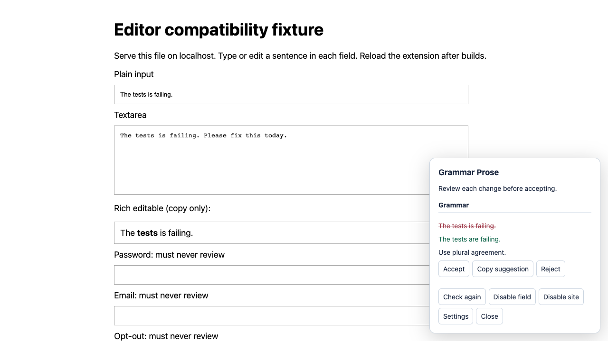

# Grammar Prose

Review English grammar, clarity, and tone in Chrome using Ollama on your computer.
Grammar Prose explains each suggestion and lets you accept, reject, or copy it.
You choose every change; drafts are never saved by the extension.



Grammar Prose reviewing synthetic text in the isolated editor fixture with a
deterministic test transport. The draft stays unchanged until you accept a suggestion.

## Preview status

**Early development preview.** The extension runs from source, but model quality
and real-site editor compatibility remain open. Review every suggestion carefully.

- `qwen3.5:9b` is the development baseline. A tone rewrite has invented a factual
  claim; passing category checks does not establish meaning preservation.
- Plain text fields expose Accept. Exact replacement and native undo/redo have
  been verified in the textarea fixture; React-controlled fields and real sites
  still need their own evidence.
- Contenteditable fields offer Copy suggestion. Google Docs and rich-editor
  replacement are unsupported.
- Reviews use completed sentences, fields up to 6,000 characters, and a 25-second
  deadline. These limits are initial choices rather than measured performance budgets.

See the [compatibility matrix](docs/compatibility.md),
[model verification report](docs/verification/qwen-verification.md), and
[remaining product gates](docs/upgrade-plan.md#remaining-product-and-release-gates).

## Getting started

### Prerequisites

- [Git](https://git-scm.com/downloads) and Google Chrome.
- [Node.js](https://nodejs.org/en/download), using the version in `.nvmrc`
  (currently 26.10.0), and pnpm 12.6.0.
- [Ollama](https://ollama.com/download) for actual writing reviews. Building and
  deterministic tests do not require a model.

The Qwen model download is approximately 6.6 GB. The recorded test machine was an
Apple M1 Pro with 16 GiB unified memory; Ollama reported 5.7 GB loaded. Reviews in
the production evaluation took roughly 3–8 seconds, and the machine had substantial
swap usage. These observations are not minimum hardware requirements or a guarantee
of comfortable memory headroom. Other hardware needs its own evaluation.

### Build and load the extension

```sh
git clone https://github.com/this-caroline/Grammar-Prose.git
cd Grammar-Prose
```

On macOS/Linux with [nvm](https://github.com/nvm-sh/nvm#installing-and-updating),
install and activate the project version:

```sh
source "$HOME/.nvm/nvm.sh"
nvm install
nvm use
```

On Windows, install the matching Node version through the Node.js download page
or your version manager. The remaining build commands work with that Node version:

```sh
npm install --global pnpm@12.6.0
node --version
pnpm --version
pnpm install --frozen-lockfile
pnpm build
```

Node must satisfy `>=26.10.0 <27`; pnpm should report `12.6.0`. If your shell resolves
an older pnpm launcher, reopen it and check the executable path.

1. Open `chrome://extensions` and enable **Developer mode**.
2. Choose **Load unpacked** and select the generated `dist/` folder.
3. Copy the extension ID shown on that page; Ollama needs it in the next step.

After source changes, run `pnpm build`, reload the extension, and refresh target tabs.

## Run with local Ollama

Download the development model explicitly:

```sh
ollama pull qwen3.5:9b
ollama list
```

Quit any running Ollama app or server, then start a foreground server with cloud
access disabled. Replace `YOUR_EXTENSION_ID` with the ID from Chrome.

On macOS/Linux in Bash or Zsh:

```sh
OLLAMA_NO_CLOUD=1 \
OLLAMA_HOST=127.0.0.1:11434 \
OLLAMA_ORIGINS="chrome-extension://YOUR_EXTENSION_ID" \
OLLAMA_CONTEXT_LENGTH=8192 \
ollama serve
```

On Windows in PowerShell:

```powershell
$env:OLLAMA_NO_CLOUD = "1"
$env:OLLAMA_HOST = "127.0.0.1:11434"
$env:OLLAMA_ORIGINS = "chrome-extension://YOUR_EXTENSION_ID"
$env:OLLAMA_CONTEXT_LENGTH = "8192"
ollama serve
```

Keep that terminal open. Click the extension's toolbar action to open settings,
check the connection, enter `qwen3.5:9b`, and save.
The extension never downloads or silently selects a model. Alternative models must
support `think: false` and need their own [evaluation](docs/evaluation.md).

## Use Grammar Prose

1. Focus an ordinary text field, finish a sentence with punctuation, then pause.
2. Click the suggestion indicator, or request a review with ⌘⇧Y on macOS or
   Alt+Shift+G on Windows/Linux. Settings show Chrome's actual assigned shortcut;
   customize it at `chrome://extensions/shortcuts`.
3. Review the original passage, proposed replacement, and explanation.
4. Choose **Accept**, **Reject**, or **Copy suggestion**. Tone suggestions also
   offer **Too soft** feedback.

Accept requires the field to match the reviewed snapshot exactly. Numeric changes
and removal of protected terms are filtered, but semantic preservation still needs
human judgment. Before daily use, complete the
[model acceptance benchmark](docs/evaluation.md#acceptance-benchmark-and-adoption-gate).

**Disable field** lasts until the field is recreated or the page reloads.
**Disable site** persists until removed in settings. Passwords, non-text input
types, readonly/disabled controls, recognized credential fields, and opted-out
fields are excluded. Chrome restricted pages cannot be reviewed.

## Privacy and permissions

The extension sends reviewed text to `http://localhost:11434`, rejects redirects,
and has no telemetry. It requires HTTP(S) content-script access to detect editable
fields, localhost access for inference, and Chrome local storage for settings and
memory. A local Ollama server can still use a cloud model; keep the local-only
configuration above when reviewing private writing.

Drafts, suggestions, and model explanations are not persisted by the extension.
Its inspectable memory stores fixed feedback counts, a too-soft count, protected
terms, and user-written tone preferences. Settings let you edit, delete, and export
memory. Copying a suggestion does not count as acceptance. See the
[architecture invariants](docs/architecture.md#safety-and-privacy-invariants) for details.

## Troubleshooting

| Symptom                              | What to check                                                                                                                    |
| ------------------------------------ | -------------------------------------------------------------------------------------------------------------------------------- |
| Cannot reach Ollama                  | Keep `ollama serve` running on port 11434; use settings to check the connection.                                                 |
| HTTP 403 / denied extension origin   | Set `OLLAMA_ORIGINS` to the exact `chrome-extension://<extension-id>` origin and restart the server.                             |
| Model missing / HTTP 404             | Confirm the exact installed name with `ollama list`, then save it in settings.                                                   |
| Review times out                     | Requests have a 25-second deadline. Check model load and memory pressure; evaluate any alternative model before adopting it.     |
| Shortcut does nothing                | Check the assigned command at `chrome://extensions/shortcuts` and focus an eligible field.                                       |
| Accept is unavailable or fails       | Rich editors are copy-only. If a plain field changed or cannot safely apply the edit, use Copy suggestion and inspect the field. |
| Changes to the extension are missing | Rebuild, reload the extension, and refresh the target tab.                                                                       |

No API key, backend, database, Docker service, or `.env` file is required.

## Contributing

Report bugs and propose improvements through
[GitHub issues](https://github.com/this-caroline/Grammar-Prose/issues).
For bugs, include reproduction steps, expected and actual behavior, browser/OS
versions, and model/Ollama versions when relevant. Use synthetic text; do not
include private drafts, memory exports, or personal browser profiles.

For changes, fork the repository, create a focused branch, and open a pull request
explaining the behavior changed and how you verified it. Preserve explicit
acceptance, exact snapshot matching, native undo, loopback-only inference, and
no persisted drafts. Follow the [quality gate](docs/code-quality.md); add behavioral
tests for meaningful changes. Keep comments only for necessary, non-obvious
constraints and fix lint findings without exceptions.

### Develop

After the frozen installation above, run:

```sh
pnpm exec playwright install chromium
pnpm format
pnpm check
pnpm test:e2e
```

`pnpm check` verifies formatting, linting, types, dead code, deterministic tests,
and a clean build. `pnpm test:e2e` exercises the built extension in isolated
Chromium with a deterministic transport. Neither establishes real-site
compatibility or model quality. For coverage and health analysis, follow the
[coverage workflow](docs/code-quality.md#fallow-analysis).

For manual editor checks, serve the synthetic fixture:

```sh
python3 -m http.server 8000 --bind 127.0.0.1 --directory tests
```

Open `http://127.0.0.1:8000/editor-fixture.html` and test exact replacement,
selection, and native undo/redo. Framework-controlled fields require separate
fixtures and evidence. Model/prompt changes follow the
[evaluation workflow](docs/evaluation.md); real inference stays outside general CI.

## Documentation

Each document owns one topic; link to it instead of duplicating its instructions.

| Document                                                                   | Purpose                                                                    |
| -------------------------------------------------------------------------- | -------------------------------------------------------------------------- |
| [AGENTS.md](AGENTS.md)                                                     | Repository-wide coding-agent instructions                                  |
| [Architecture](docs/architecture.md)                                       | Layer ownership, privacy/editing invariants, operating limits              |
| [Code quality](docs/code-quality.md)                                       | Coding standards, test design, checks, coverage workflow                   |
| [Compatibility](docs/compatibility.md)                                     | Editor evidence and unverified surfaces                                    |
| [Evaluation](docs/evaluation.md)                                           | Datasets, evaluation commands, model adoption requirements                 |
| [Upgrade plan](docs/upgrade-plan.md)                                       | Tooling decisions and remaining product/release gates                      |
| [Foundation verification](docs/verification/foundation-verification.md)    | Historical Gemma failures, prompt comparison, architecture-review evidence |
| [Qwen verification](docs/verification/qwen-verification.md)                | Historical model comparison, development adoption, known semantic failure  |
| [Editor compatibility skill](.agents/skills/editor-compatibility/SKILL.md) | Repeated editor reproduction and verification workflow                     |
| [Review evaluation skill](.agents/skills/review-evaluation/SKILL.md)       | Repeated model/prompt comparison workflow                                  |

Verification reports preserve dated measurements, not current-checkout test results.

Technical references: [Chrome extension network requests](https://developer.chrome.com/docs/extensions/develop/concepts/network-requests),
[Ollama structured outputs](https://docs.ollama.com/capabilities/structured-outputs),
and [Ollama FAQ](https://docs.ollama.com/faq).

## License

Grammar Prose is available under the [MIT license](LICENSE).
