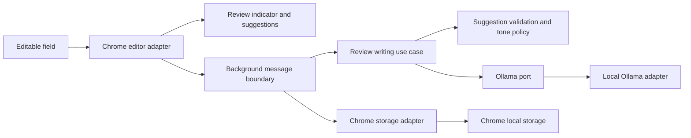

# Architecture and invariants

Status: runnable foundation. `qwen3.5:9b` is the development baseline; no real-site compatibility or semantic-quality claims have been validated.

See the [upgrade plan](upgrade-plan.md) for tooling choices and remaining product gates. The invariants below remain requirements throughout those upgrades.

## Boundaries

- `domain/review.ts` and `domain/policy.ts`: categories, bounded pattern taxonomy, exact passage validation, feedback counters, memory validation, and tone policy. No Chrome or network dependencies.
- `application/review.ts`: completed-sentence review use case and inference port. It rejects oversized input and cancelled results.
- `adapters/ollama.ts`: fixed loopback endpoint, model discovery, and structured-response transport using the domain schema and policy. Drafts are explicitly untrusted data. Prompt instructions alone cannot prove meaning preservation.
- `adapters/storage.ts`: validated local memory/settings reads and writes. No draft logging or draft history.
- `chrome/background.ts`: message validation, authoritative site disable checks, cancellation, request deadline, limited concurrency, serialized memory/settings writes, feedback tied to suggestions actually returned.
- `chrome/editor.ts`: field eligibility, extraction, exact replacement and selection preservation. Native `insertText` is verified for the textarea fixture in the [compatibility matrix](compatibility.md); other editors require their own evidence. There is no direct `.value` fallback that silently discards undo.
- `chrome/content.ts`: debounce, IME handling, request revisions, stale snapshots, session-bound asynchronous actions, and explicit acceptance. Rich editors are copy-only.
- `chrome/view.ts`: shadow-DOM styles, review rendering, and action callbacks. It does not own editor or review-session state.

## Safety and privacy invariants

1. No draft mutation without acceptance. Before replacement, the entire current field must equal the reviewed snapshot and the passage must match its exact offsets.
2. Drafts and suggestions exist in memory only. Background suggestion cache is bounded and cleared on cancellation or settings changes. Memory changes cancel in-flight reviews while keeping feedback available for already displayed suggestions. Service-worker restarts may discard feedback context; drafts are never persisted to recover it.
3. Feedback consists of fixed pattern identifiers and counts. No automatic “anonymized examples” are stored yet: reliable anonymization needs a separate design. Users can explicitly enter terms and preferences.
4. Validation drops missing or ambiguous passages, category/pattern mismatches, protected-term removal, numeric changes, malformed records and duplicates. It cannot prove that a rewrite preserves urgency, negation, meaning, or intent. Those require the [acceptance benchmark and human review](evaluation.md#acceptance-benchmark-and-adoption-gate).
5. The extension sends requests only to `http://localhost:11434`, rejects redirects, and has no telemetry. A local Ollama server can itself use a cloud model; use Ollama local-only mode before any private evaluation. Foundation code does not certify server configuration.
6. Site settings are checked in the worker for both the tab and frame hostname. Per-field disable is ephemeral; site disable persists. HTTP(S) frames are included. Opaque, sandboxed, closed-shadow-root and special editor surfaces are not promised.

## Operating limits

Automatic retries and offline polling are deliberately absent: a failed review shows a status and the user can retry. The current 25-second request deadline and 6,000-character bound are initial limits, not benchmark-derived choices.

Sentence completion currently uses punctuation with a small abbreviation exclusion list. It handles lowercase continuations but is a heuristic; uncommon abbreviations, URLs, and prose mixed with code need benchmark cases.
