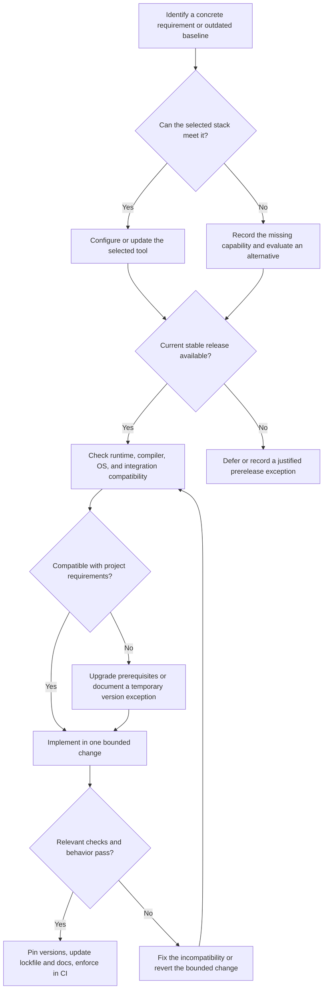

# Upgrade plan and decision tree

Established: 2026-09-27. This document records the implemented foundation and the remaining product gates.

Model evidence: [Qwen verification, 2026-10-03](verification/qwen-verification.md), following the [Gemma baseline](verification/foundation-verification.md). The latter also records a later architecture review with 128 deterministic tests and 21 browser scenarios. These are dated observations, not a claim that the current checkout or remote CI has passed. Qwen resolves the observed grammar failure, but tone quality and human review remain open.

## Direction

Start with current stable tooling. Verify versions against official documentation and the package registry when implementing; avoid selecting old versions from remembered examples. Use prereleases only for a demonstrated need, with the tradeoff recorded.

Keep the domain/application/adapter architecture and the privacy and editing invariants in [architecture.md](architecture.md). Modernizing the toolchain must preserve product behavior. Browser compatibility targets are a separate product decision from compiler and development-runtime versions.

## Tooling baseline

Exact dependency versions belong to `package.json` and `pnpm-lock.yaml`; the development runtime belongs to `.nvmrc`, package engines, and CI configuration. The selected stack is TypeScript, esbuild, pnpm, type-aware Oxlint, Oxfmt, Vitest, Playwright, and Fallow. [Code quality](code-quality.md) owns enforcement and coverage details; [README](../README.md#develop) owns installation commands.

The foundation has typed and validated message/storage/model boundaries, deterministic tests, a built-extension Chromium harness, combined coverage, repository skills, and a configured CI workflow. Local verification reports do not prove a successful hosted CI run. Dependabot is configured; packaged releases remain pending.

“Current stable” governs adoption. Exact versions and a committed lockfile govern reproducibility. New releases arrive through reviewed updates rather than floating CI installations.

## Decision tree for upgrades and additions

Use these concrete branches:

| Decision                                | Default                                                | Reconsider when                                                                                                                                                 |
| --------------------------------------- | ------------------------------------------------------ | --------------------------------------------------------------------------------------------------------------------------------------------------------------- |
| Oxlint or ESLint?                       | Oxlint                                                 | A necessary rule or plugin is missing or behaves incorrectly. Document the specific gap before adding a second linter.                                          |
| Oxfmt or Prettier?                      | Evaluate Oxfmt first                                   | A required file format or formatting behavior fails the repository trial. One formatter owns each file.                                                         |
| Upgrade Node or hold back?              | Latest stable Current for this development toolchain   | Required tools or deployment environments lack support. Any future production server gets its own supported-LTS decision.                                       |
| Add a skill or ordinary documentation?  | Documentation for facts; skill for a repeated workflow | Create a skill when reusable steps, checks, or scripts materially improve execution.                                                                            |
| Add a schema library?                   | One shared contract and validation approach            | Compare a small handwritten validator with a schema library on actual message/storage/model contracts; select one based on clarity, inference, and bundle cost. |
| Add a UI or extension framework?        | Keep the existing implementation                       | Repeated UI/state/build complexity or a required platform exceeds what small modules can maintain reliably.                                                     |
| Split packages or add backend services? | Keep a modular single repository                       | Independent consumers, deployments, ownership, or measured scaling needs require separation.                                                                    |
| Add editor replacement support?         | Copy-only until verified                               | Adapter tests prove exact replacement, selection, native undo/redo, and framework state synchronization.                                                        |
| Change model or prompt?                 | Run the evaluation corpus                              | Adopt only with recorded quality and latency evidence; valid JSON alone is insufficient.                                                                        |

## Remaining product and release gates

This is the canonical work-status list. Architecture owns invariants, compatibility owns editor evidence, evaluation owns model acceptance, and dated verification reports preserve measurements. Update this list only with evidence; partial implementation does not close a gate.

| Gate               | Present                                                                                                                                                     | Still required                                                                                                                                       |
| ------------------ | ----------------------------------------------------------------------------------------------------------------------------------------------------------- | ---------------------------------------------------------------------------------------------------------------------------------------------------- |
| Review quality     | Local inference, conservative prompt, validation, synthetic corpora, raw schema/rejection metrics and offline scoring                                       | User-approved benchmark and human semantic scores, bounded prompt comparison and holdout confirmation, resolution of invented facts in tone rewrites |
| Reliable editing   | Explicit acceptance, snapshot guards, native undo/redo, selection mapping; React, frames, settings/worker races and keyboard fixtures                       | Real IME input, stable-Chrome and real-site verification, browser zoom and manual accessibility checks                                               |
| Rich editors       | Contenteditable extraction and copy fallback                                                                                                                | Verified editor-specific replacement before enabling Accept; see [compatibility](compatibility.md)                                                   |
| Personalization    | Feedback counts, editable terms/preferences, delete/export UI                                                                                               | Evidence that feedback improves results; separate safe-storage design before storing examples                                                        |
| Daily use          | Debounce, shortcut, site switch, connection errors                                                                                                          | Sustained latency and memory budgets, browser overhead across tabs/frames, positioning and usability checks                                          |
| Reusable workflows | Repository skills exercised on synthetic Qwen evaluation and React/frame/worker fixtures                                                                    | Approved personal quality comparison and real-site editor workflow verification                                                                      |
| Release lifecycle  | Schema-1 settings/memory, migration/downgrade fixtures, explicit recovery, generated manifest version, deterministic ZIP and checksum, setup/recovery notes | Real-Ollama archive smoke, preserved-profile upgrade/rollback, exact-release-commit hosted CI; 1.0.0 only after all gates pass                       |

Use [code-quality.md](code-quality.md#completion-workflow) for the completion commands, [compatibility.md](compatibility.md) for browser proof, and [evaluation.md](evaluation.md) for real-model comparisons. Real inference stays outside general CI. Publishing is separate from preparing release artifacts.

Revert a failed tooling upgrade as a coherent manifest/config/lockfile change without discarding unrelated work. Storage upgrades need an explicit recovery path. For a blocked upgrade, record the exact incompatibility, affected version, workaround, and condition for revisiting it; avoid unexplained long-term version caps.

## Reference sources

- [Oxlint type-aware linting](https://oxc.rs/docs/guide/usage/linter/type-aware): configuration, additional dependency, and TypeScript compatibility.
- [Oxfmt](https://oxc.rs/docs/guide/usage/formatter): formatting workflow and supported file types; future upgrades still require a repository trial.
- [Node release policy](https://nodejs.org/en/about/previous-releases): verify Current/LTS status when adopting a runtime; the selected development version is pinned in `.nvmrc`.
- [Vitest capabilities](https://vitest.dev/guide/features.html): unit-test tooling and coverage.
- [Playwright extension testing](https://playwright.dev/docs/chrome-extensions): Chromium persistent-context requirements.
- [Repository skills](https://learn.chatgpt.com/docs/build-skills): `.agents/skills/` discovery and skill packaging.

The [2026-10-04 implementation report](verification/pilot-implementation.md) records current local proof and the [candidate notes](release-pilot.md) describe packaging and rollback. These do not close the personal quality, real-site, sustained-use, five-day or hosted release-CI gates.
